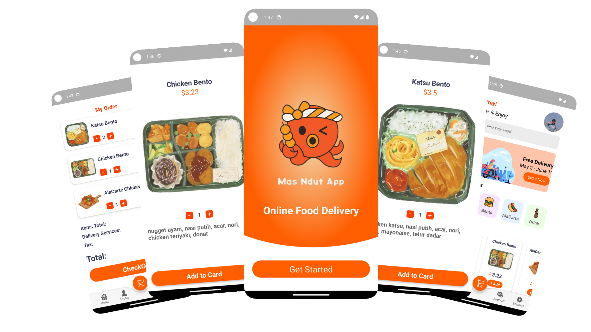

## Food Order Application Laksmana Rakho

Food order application adalah sebuah prototype aplikasi pemesanan makanan secara online untuk sebuah restoran, pada tugas kali ini adalah restoran saya, Mas Ndut. Prototype Aplikasi ini adalah salah satu tugas dari mata kuliah mobile programming dan menjadi tugas akhir mahasiswa agar bisa lulus. aplikasi ini menyediakan poin pencarian, preview makanan dan laman checkout. android studio merupakan aplikasi untuk membuat aplikasi food order dengan bahasa pemrograman Java dan menggunakan Skema Extensible Markup Language atau XML. check -> [Food Order Application Laksmana Rakho](https://github.com/mas003/TB2-Android-Studio/tree/tugas).

> **Note**
>
> aplikasi ini adalah tugas akhir dari mata kuliah mobile programming. aplikasi ini berfokus pada implementasi dari materi yang sudah diberikan sebelumnya seperti : checkbox, recycler view, macam-macam layout, button, text view dan text edit,image view, pemrograman Java dan lain-lain, sehingga aplikasi ini masih sangat terbatas seputar materi yang disebutkan. namun pengembangan masih mungkin dilakukan sehingga bisa dipantau saja di [`tugas` branch](https://github.com/mas003/TB2-Android-Studio/tree/tugas)

## Penerapan

untuk memulai aplikasi food order ini, bisa mengikuti langkah-langkah berikut ini -> [jjj](jsjjs)

## Stack

kesimpulan nya, aplikasi ini terlihat seperti ini karena sudah termasuk pada :

* **Front-End** - Skema Extensible Markup Language atau XML, digunakan untuk mengatur dan men setting front-end aplikasi pada android studio
* **Back-End** - Bahasa pemrograman Java, adalah bahasa inti yang digunakan pada android studio dalam mengatur aplikasi
* **Gradle** - Gradle, sebuah toolkit build canggih, untuk mengotomatiskan dan mengelola proses build. Android Studio menggunakan Gradle sebagai dasar sistem build, dengan lebih banyak kemampuan khusus Android yang disediakan oleh plugin Android Gradle.
* **API** - Android Studio menggunakan API dari Reqres.in. Android Studio juga menggunakan API bahasa Java 8. 

